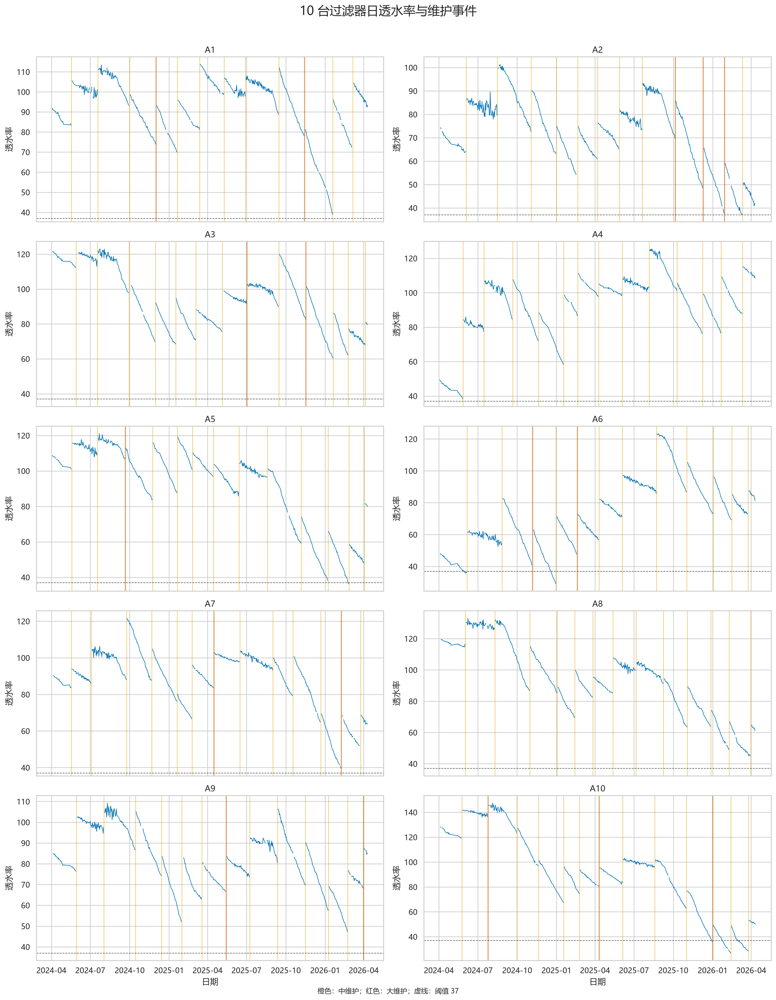
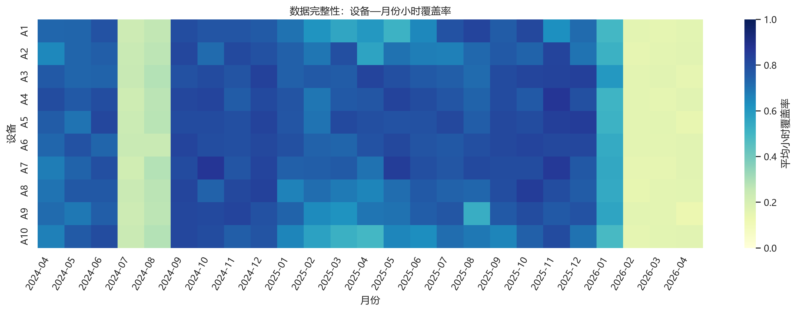
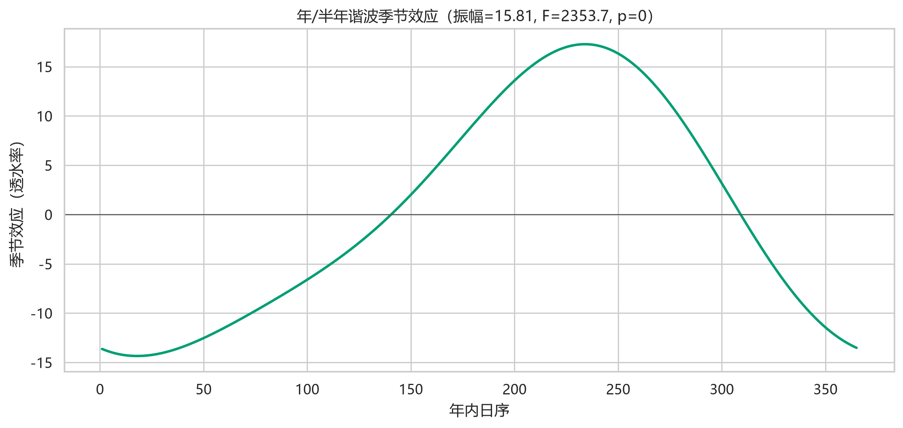
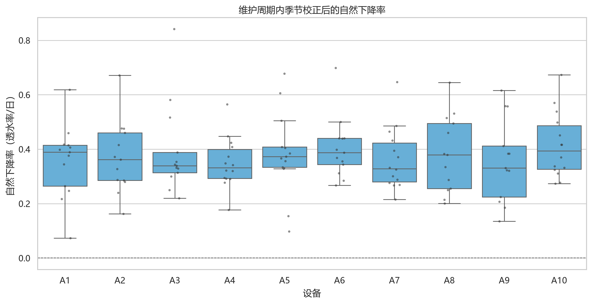
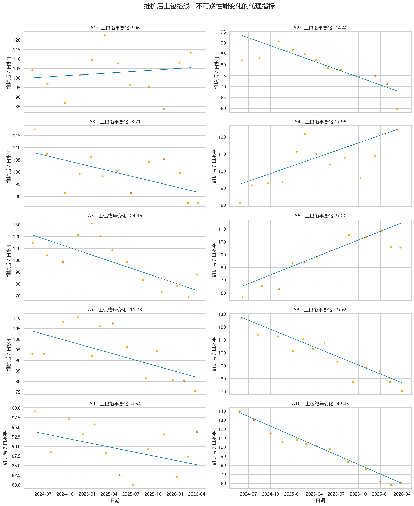
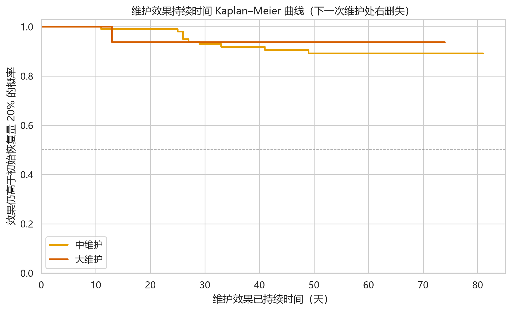
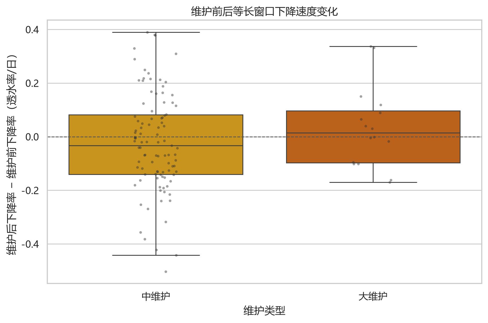
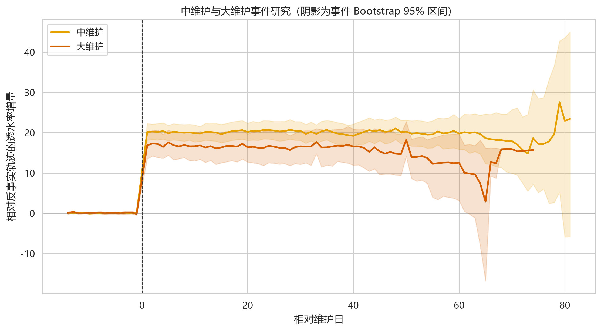
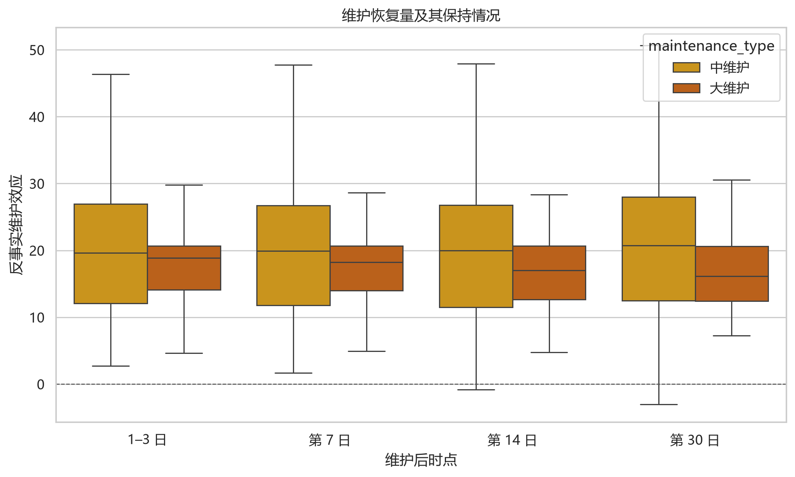
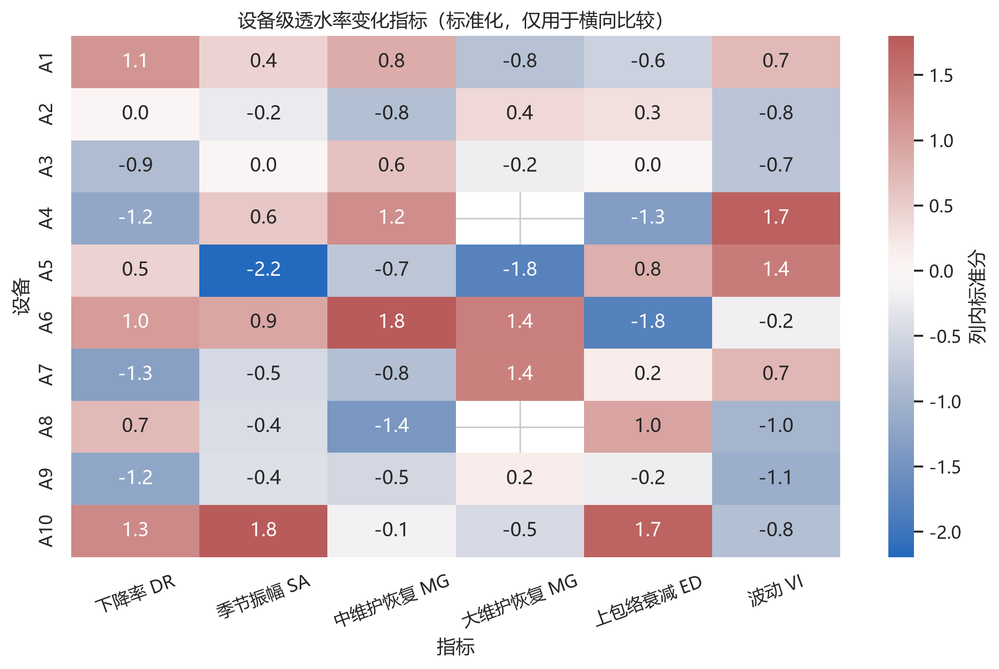

# 第一问：数据处理、透水率变化规律与维护影响

## 1. 分析口径

本问使用附件 1 的小时级透水率和附件 2 的中、大维护日期。维护导致的跃升是研究对象，不能作为异常值删除。程序仅将远离维护日前后 2 天、相对局部滚动中位数偏离超过 6 倍 MAD 的孤立点标记为传感器异常；趋势和维护效果分析使用每日不少于 3 个有效小时观测的日中位数。

缺失小时不做全局线性填补。短缺口插值只用于频谱辅助分析，维护效果估计始终使用实际观测。季节性通过设备固定差异、设备长期趋势和距上次维护时间控制后的年/半年谐波项检验；下降率在维护周期内用 Theil–Sen 稳健斜率估计；维护效果用维护前 21 天趋势外推形成反事实轨迹。

## 2. 数据质量

10 台设备共有 114,977 条时间记录，其中有效透水率 110,632 条。各设备按完整日历小时计算的覆盖率在 58.6%—66.1% 之间；每日不少于 3 个有效小时的日尺度覆盖率为 91.6%—94.6%，因此主分析采用日中位数。

设备内时间戳重复检查结果为 0 条；10 台设备均无重复时间戳，无需删除或合并重复记录。

| device   |   rows |   valid_values |   missing_rate |   duplicate_timestamps |   calendar_hour_coverage |   calendar_day_coverage |   outliers_flagged |   minimum |   maximum |
|:---------|-------:|---------------:|---------------:|-----------------------:|-------------------------:|------------------------:|-------------------:|----------:|----------:|
| A1       |  10839 |          10382 |           4.22 |                      0 |                    58.63 |                   92.14 |                106 |     38.64 |    140.37 |
| A2       |  11125 |          10719 |           3.65 |                      0 |                    60.55 |                   93.77 |                109 |     28.06 |    121.72 |
| A3       |  11921 |          11512 |           3.43 |                      0 |                    65.02 |                   93.9  |                128 |     51.5  |    154.57 |
| A4       |  11675 |          11230 |           3.81 |                      0 |                    63.43 |                   91.6  |                108 |     31.56 |    143.75 |
| A5       |  12162 |          11704 |           3.77 |                      0 |                    66.11 |                   94.58 |                154 |     34.53 |    149.81 |
| A6       |  11806 |          11344 |           3.91 |                      0 |                    64.07 |                   93.09 |                124 |     28.65 |    155.92 |
| A7       |  11976 |          11520 |           3.81 |                      0 |                    65.23 |                   93.49 |                142 |     39.41 |    158.57 |
| A8       |  11507 |          11089 |           3.63 |                      0 |                    62.79 |                   93.76 |                115 |     37.63 |    165.15 |
| A9       |  11223 |          10768 |           4.05 |                      0 |                    60.97 |                   92.54 |                115 |     44.19 |    139.39 |
| A10      |  10743 |          10364 |           3.53 |                      0 |                    58.6  |                   94.04 |                128 |     26.43 |    180    |

维护记录共 127 次，其中中维护 110 次、大维护 17 次。A4、A8 在附件 2 中没有大维护记录，这与题面所述“一般每年 1—4 次”不一致，后续设备级大维护指标保持缺失，不进行人为填补。

## 3. 周期性

加入年周期与半年周期谐波项后，残差平方和相对下降 57.88%；嵌套模型 F=2353.68，p<1e-300。估计季节效应半振幅为 15.81，年周期基波振幅为 15.11，半年周期振幅为 2.84。

季节曲线峰值约出现在年内第 234 天，谷值约出现在第 18 天。统计上季节项显著，但数据仅覆盖约两年，只有两个完整年循环，因此应将其解释为“存在显著季节性证据”，不能宣称已经稳定识别长期气候周期。

频谱功率最大的候选周期如下（频谱只作辅助证据）：

|   period_days |   relative_power |
|--------------:|-----------------:|
|       369.5   |            0.823 |
|       184.75  |            0.037 |
|       246.333 |            0.022 |
|       147.8   |            0.017 |
|       123.167 |            0.014 |
|        92.375 |            0.013 |
|        82.111 |            0.011 |
|        73.9   |            0.01  |

## 4. 下降趋势与规律

剔除季节项后，共获得 133 个满足至少 14 个观测日且跨度不少于 14 天的维护周期。所有周期的稳健斜率均表现为下降，下降率中位数为 0.362 透水率/日，四分位区间为 0.291—0.440，完整范围为 0.074—0.841。这说明维护间隔内透水率持续下降的规律具有稳定性，但下降速度在设备和周期之间差异明显，寿命模型应使用分层参数和过程噪声，而不能给每台设备只拟合一条直线。

| device   |   中位下降率 |
|:---------|--------:|
| A1       |   0.39  |
| A2       |   0.362 |
| A3       |   0.339 |
| A4       |   0.332 |
| A5       |   0.373 |
| A6       |   0.388 |
| A7       |   0.328 |
| A8       |   0.379 |
| A9       |   0.331 |
| A10      |   0.393 |

维护后 1—7 日季节校正水平的稳健回归斜率被定义为“上包络线变化率”，用于表征不可逆性能上限。正的年衰减值表示即便维护后，设备可恢复到的水平仍在下降；该指标将在第二问中作为固有性能老化速度的初值。

## 5. 中维护和大维护的影响

中维护的 1—3 日反事实恢复量均值为 20.17，95% Bootstrap 区间为 [18.34, 22.25]，有效事件数 104；大维护对应均值为 17.30，95% 区间为 [13.94, 20.50]，有效事件数 17。

两类维护 1—3 日效果的 Mann–Whitney 检验 p=0.278。由于大维护仅有 17 个有效事件，且通常在状态更差时被选择，不能仅根据样本均值断言哪类维护的物理清洗能力更强；事件研究已控制维护前局部趋势和共同季节项，但仍可能存在按设备状态选择维护类型的剩余混杂。

### 5.1 维护效果持续时间

将维护后 1—3 日反事实恢复量记为初始效果，对事件曲线作 5 日滚动中位数平滑；当平滑效果连续 3 个可用观测点不高于初始效果的 20% 时，记为效果终点。观察在下一次维护前或数据结束时停止，未观察到终点的事件按右删失处理。

中维护共有 104 个可分析事件，其中 94 个右删失，删失率 90.4%；截至 60 日的限制平均持续时间为 56.8 日。大维护共有 17 个可分析事件，其中 16 个右删失，删失率 94.1%，截至 60 日的限制平均持续时间为 57.1 日。两类维护的 Kaplan–Meier 中位持续时间均未在当前随访内达到，说明多数维护效果至少保持到下一次维护，不能把随访末日误当作真实终点。

### 5.2 维护前后下降速度变化

采用维护前 21 日和维护后第 4—24 日两个等长窗口分别估计 Theil–Sen 下降率。中维护有 99 个有效事件、覆盖 10 台设备；设备中位变化为 -0.050 透水率/日，设备聚类 Bootstrap 95% 区间为 [-0.101, 0.039]，设备级 Wilcoxon p=0.131。大维护对应中位变化为 0.011，95% 区间为 [-0.083, 0.089]，p=0.945。两类区间均跨 0，当前数据没有证据表明维护会系统性改变随后下降速度。

## 6. 透水率变化指标体系

为后续寿命预测提供可解释输入，定义以下指标：

1. **数据覆盖率 CR**：有效小时数/完整日历小时数；
2. **自然下降率 DR**：维护周期内季节校正透水率 Theil–Sen 斜率的相反数；
3. **季节振幅 SA**：设备级年/半年谐波曲线的半极差；
4. **瞬时恢复量 MG**：维护后 1—3 日实际值相对维护前趋势反事实值的增量；
5. **30 日保持率 MP30**：第 27—30 日维护效应/1—3 日恢复量；
6. **上包络衰减 ED**：维护后 1—7 日水平随年份变化斜率的相反数；
7. **波动指数 VI**：控制设备、长期趋势、维护时钟和季节项后的残差标准差。
8. **维护效果持续时间 TE**：维护效果持续高于初始恢复量 20% 的时间；存在下一次维护造成的右删失。
9. **下降率变化 ΔDR**：维护后等长窗口下降率减去维护前下降率；按设备聚类评估不确定性。

这些指标保留物理含义，不强行压缩为单一综合分数。第二问可将 DR、SA、MG、TE、ED 和 VI 分别映射到堵塞增长、季节函数、维护恢复、恢复持续性、不可逆老化和过程噪声参数；ΔDR 的区间跨 0，因此当前模型不需要为维护后另设确定性堵塞增长率。

| device   |   decline_rate_median |   seasonal_amplitude |   medium_gain_3d_median | major_gain_3d_median   |   medium_retention_day30_median | major_retention_day30_median   |   envelope_decline_per_year |   residual_volatility |
|:---------|----------------------:|---------------------:|------------------------:|:-----------------------|--------------------------------:|:-------------------------------|----------------------------:|----------------------:|
| A1       |                 0.39  |               18.529 |                  23.665 | 12.071                 |                           1.07  | 0.025                          |                      -2.964 |                 9.788 |
| A2       |                 0.362 |               16.573 |                  18.203 | 19.143                 |                           1.026 | 0.892                          |                      14.403 |                 6.796 |
| A3       |                 0.339 |               17.295 |                  22.915 | 15.505                 |                           1.067 | 1.062                          |                       8.709 |                 6.844 |
| A4       |                 0.332 |               18.893 |                  24.819 | —                      |                           1.086 | —                              |                     -17.955 |                11.827 |
| A5       |                 0.373 |               10.918 |                  18.554 | 6.178                  |                           0.873 | 1.170                          |                      24.958 |                11.218 |
| A6       |                 0.388 |               20.008 |                  26.764 | 25.082                 |                           1.064 | 1.057                          |                     -27.198 |                 7.992 |
| A7       |                 0.328 |               15.924 |                  18.188 | 24.971                 |                           0.963 | 1.066                          |                      11.735 |                 9.847 |
| A8       |                 0.379 |               16.07  |                  16.228 | —                      |                           0.881 | —                              |                      27.688 |                 6.359 |
| A9       |                 0.331 |               16.18  |                  19.248 | 17.869                 |                           1.069 | 1.006                          |                       4.638 |                 6.16  |
| A10      |                 0.393 |               22.502 |                  20.418 | 14.118                 |                           0.866 | 0.978                          |                      42.43  |                 6.677 |

## 7. 第一问结论与第二问接口

1. 小时级数据存在较大间断，但日尺度覆盖较好；以日中位数为主、小时级作质量检查是更稳健的口径。
2. 控制设备差异、长期趋势和维护时钟后，年/半年季节项显著，但受限于只有约两年数据，外推时必须保留不确定性。
3. 透水率呈“维护后跳升—周期内下降”的锯齿形；周期下降率存在明显设备差异与周期差异。
4. 中维护和大维护总体均能带来短期恢复，但大维护样本少且存在状态选择偏差，第二问应采用跨设备共享信息的分层估计。
5. 多数事件在下一次维护前仍未降到初始效果的 20%，持续时间中位数受右删失而不可识别；第二问应把维护视为对堵塞状态的持久清除，而不是用 MP30 乘在瞬时恢复量上。
6. 维护前后等长窗口下降率变化的设备聚类区间均跨 0，暂无证据支持维护后采用另一套固定堵塞增长率。
7. 维护后上包络线并非恒定，说明只建模可逆堵塞不足，必须同时引入不可逆老化/维护损伤状态。
8. `tables/device_indicators.csv`、`tables/maintenance_effect_duration.csv`、`tables/maintenance_slope_change.csv` 和 `processed/daily_permeability.csv` 构成第二问的直接数据接口。

## 8. 局限性

- 附件没有小维护记录，未记录小维护的作用会进入周期斜率和随机误差；
- 维护类型不是随机分配，事件研究不能完全消除状态选择偏差；
- 两年数据不足以高置信度区分稳定年周期与特定年份冲击；
- 维护损伤不能仅凭单次前后跳升识别，需要第二问的双状态模型联合估计。
