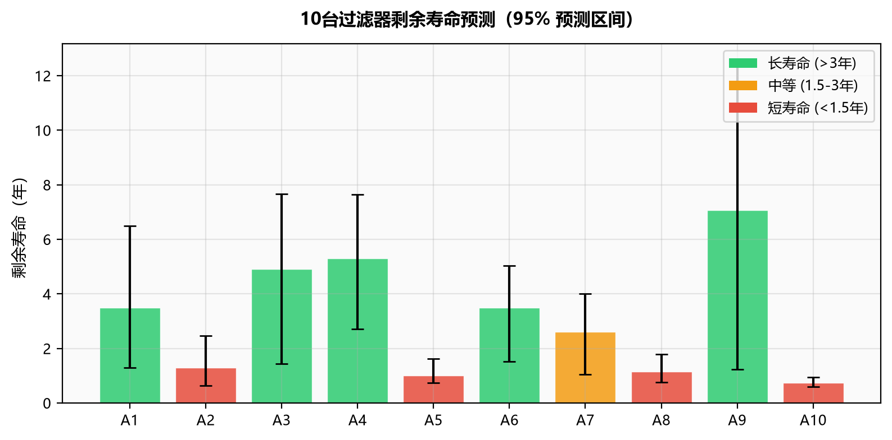

# 第二问：过滤器寿命预测分析报告

## 1. 模型

采用双状态模型

\[
P_i(t)=C_i(t)-F_i(t)+S(t)+\varepsilon_i(t),
\]

其中 \(C_i(t)\) 为不可逆性能上限，\(F_i(t)\) 为可由维护清除的堵塞状态。季节项直接读取第一问的四个谐波回归系数：

\[
(a_1,b_1,a_2,b_2)=(-9.633,-11.646,2.111,-1.893).
\]

维护时按第一问的反事实恢复量降低 \(F\)，并按维护类型降低 \(C\)。由于自然老化和维护损伤不能由两年数据唯一分离，基准情景将历史上包络衰减的 20% 分配给维护损伤，且大维护单次损伤取中维护的 3 倍。该比例必须在第三、四问做情景敏感性分析。

第一问的持续时间分析显示，中维护和大维护分别有 90.4% 和 94.1% 的事件在下一次维护前仍未下降到初始效果的 20%，因此模型把维护解释为堵塞状态的持久清除，不再错误地把 `MP30` 乘到瞬时恢复量上。

## 2. 固定维护规律

- 历史维护共127次：中维护110次、大维护17次。
- 中维护事件间隔约54—60日。
- 有大维护记录的设备通常在2—8次中维护后插入一次大维护。
- 排程从2026-04-10真实状态继续，首个间隔扣除已经运行的天数。
- A4/A8没有大维护记录，基准采用总体“4次中维护后插入大维护”的规律；必须另做情景复核。

## 3. 寿命终止

同时满足以下条件时寿命终止：

1. 最近365个连续日历日的平均透水率低于37；
2. 在当前状态实施一次假设大维护并继续推进30日后，30日平均透水率仍低于37。

程序计算的是完整30日平均，不是维护瞬间的单日恢复值。

## 4. 1000次蒙特卡洛结果

| 设备 | 中位寿命/年 | 95%预测区间/年 | 终止日期 | 中维护 | 大维护 |
|---|---:|---:|---|---:|---:|
| A1 | 3.49 | 1.30—6.50 | 2029-10-04 | 17 | 4 |
| A2 | 1.30 | 0.63—2.46 | 2027-07-27 | 7 | 1 |
| A3 | 4.91 | 1.44—7.66 | 2031-03-09 | 25 | 7 |
| A4 | 5.31 | 2.71—7.64 | 2031-08-01 | 27 | 7 |
| A5 | 1.00 | 0.74—1.62 | 2027-04-12 | 4 | 2 |
| A6 | 3.49 | 1.51—5.04 | 2029-10-07 | 14 | 7 |
| A7 | 2.61 | 1.04—4.00 | 2028-11-17 | 14 | 3 |
| A8 | 1.14 | 0.76—1.78 | 2027-06-02 | 6 | 1 |
| A9 | 7.06 | 1.24—12.55 | 2033-05-02 | 40.5 | 6 |
| A10 | 0.74 | 0.59—0.95 | 2027-01-04 | 4 | 1 |

10台设备共10000条轨迹均在25年随访内达到终点，没有把最长随访误当作真实寿命。

## 5. 无泄漏回测

回测以2025-04-10为切分点，所有参数只使用此前数据重新估计，验证期数据不参与训练。

| 设备 | MAE | 偏差 | 90%覆盖率 |
|---|---:|---:|---:|
| A1 | 12.90 | -4.74 | 0.326 |
| A2 | 5.22 | 2.56 | 0.870 |
| A3 | 8.89 | 7.68 | 0.587 |
| A4 | 8.46 | 0.36 | 0.843 |
| A5 | 27.42 | -27.41 | 0.025 |
| A6 | 27.52 | 27.52 | 0.057 |
| A7 | 7.38 | -0.90 | 0.905 |
| A8 | 5.93 | -1.57 | 0.815 |
| A9 | 11.24 | 8.41 | 0.513 |
| A10 | 4.14 | 2.20 | 0.961 |

A5/A6存在明显结构变化，A1/A3/A9也有较大误差。寿命结果应解释为给定模型和参数情景下的条件预测，第三问必须使用风险约束和多情景优化。

## 6. 第三、四问接口

`simulate_one_device()` 已支持维护间隔、维护交替规则、恢复量、逐次损伤、寿命阈值、30日恢复窗口以及购置和维护成本，输出：

- 寿命终点或右删失状态；
- 中维护和大维护次数；
- 平均透水率及最终365日平均；
- 大维护后30日平均；
- 总成本和年均成本。

第三问可直接改变维护规律并以年均成本为目标；第四问可循环改变购置、中维护和大维护价格。优化时必须同时改变维护损伤占比、A4/A8大维护插补和关键退化参数，检查方案稳健性。
