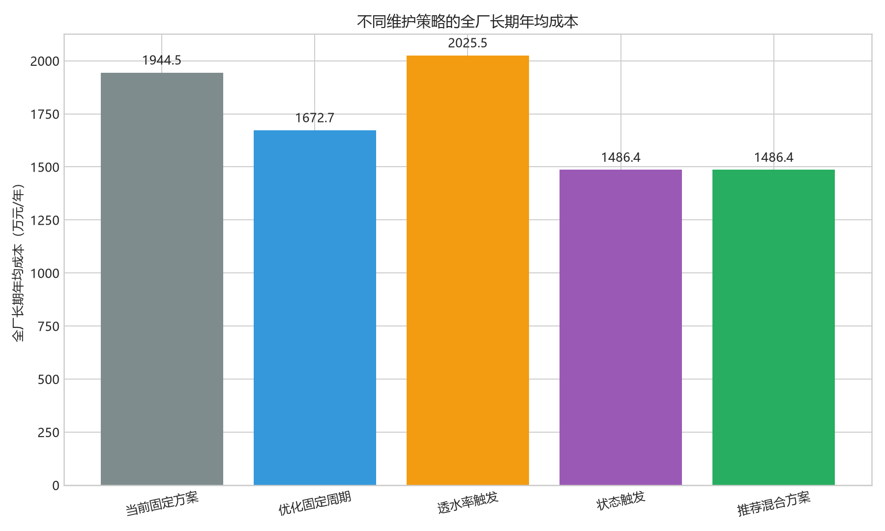
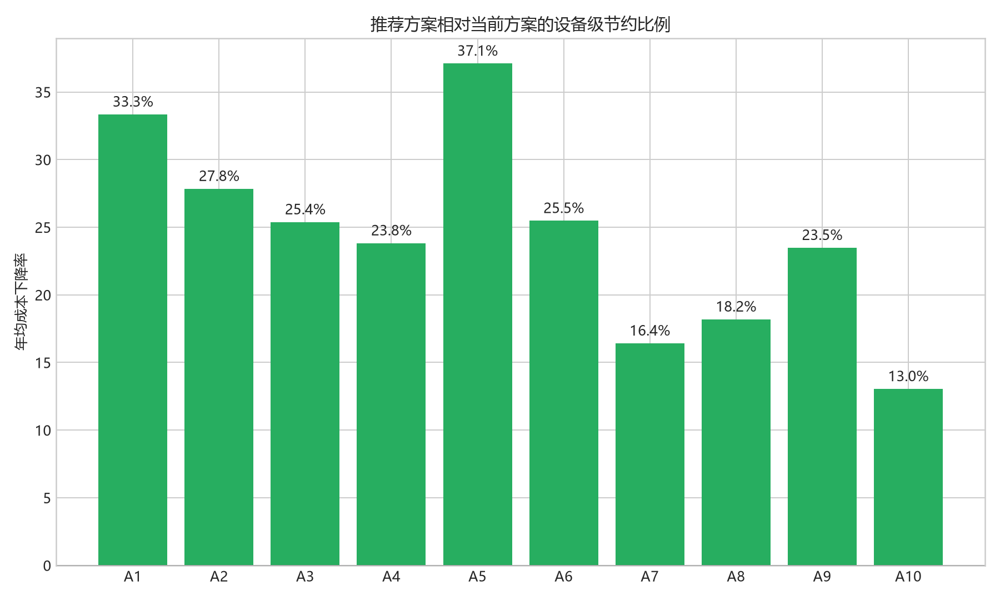

# 第三问：最优维护方案分析报告

## 1. 优化目标与统一口径

第三问直接调用第二问的双状态退化仿真器，不重新拟合寿命模型。每条蒙特卡洛轨迹都继续使用以下寿命终止条件：最近 365 个日历日平均透水率低于 37，且进行一次大维护后的 30 日平均透水率仍低于 37。

过滤器购置、中维护和大维护成本分别取 300 万元、3 万元和 12 万元。对同一策略的多条仿真轨迹，采用更新报酬定理估计长期年均成本：

\[
\widehat J=
\frac{\sum_r(300+3N_{M,r}+12N_{L,r})}
{\sum_r T_r/365.25}.
\]

该比值是“总期望成本除以总期望服役时间”，比直接平均单条轨迹的成本率更符合长期连续更新场景。

## 2. 候选维护方案

共筛选 39 组可解释策略，每台设备、每个候选先运行 40 次蒙特卡洛，入选方案再运行 300 次：

- 固定周期：5 个维护间隔（45、60、75、90、120 日）与 3 个大维护交替规则（2、4、6 次中维护后大维护），共 15 组；
- 透水率触发：以 7 日平均透水率触发中维护或大维护，并设置 21/35 日冷却期和 90/150 日最长间隔，共 12 组；
- 状态触发：以第二问模型估计的可逆堵塞损失 \(F_i(t)\) 触发维护，并比较维护后的性能储备，共 12 组。

候选策略使用相同随机种子，以减少方案比较中的蒙特卡洛噪声。20% 维护损伤占比作为基准情景；0% 和 40% 仅用于稳健性复核，不参与基准策略挑选。

## 3. 全厂方案比较

| 策略 | 全厂年均成本/万元 | 相对当前节约 | 平均寿命/年 | 中维护/年 | 大维护/年 | 两年内终止概率 |
|---|---:|---:|---:|---:|---:|---:|
| 当前固定方案 | 1944.47 | 0.00% | 3.04 | 49.31 | 13.05 | 47.93% |
| 优化固定周期 | 1672.69 | 13.98% | 3.64 | 65.45 | 10.84 | 39.57% |
| 透水率触发 | 2025.54 | -4.17% | 3.62 | 47.70 | 39.15 | 39.70% |
| 状态触发 | 1486.39 | 23.56% | 3.85 | 75.56 | 1.11 | 35.73% |

推荐采用设备级状态触发方案。与当前固定方案相比，全厂长期年均成本下降 458.08 万元，降幅 23.56%；10 台设备平均剩余寿命中位数从 3.04 年提高到 3.85 年。方案的主要变化不是简单减少维护，而是把成本较高且在本样本中恢复优势有限的大维护替换为更及时的中维护。

单纯透水率触发方案会受到季节变化和观测噪声影响，导致大维护频率上升到每年约 39.15 次，年均成本反而增加 4.17%，因此不建议直接用单一观测阈值控制维护。

## 4. 推荐维护规则

所有推荐规则均设置：最长 150 日必须检查一次维护；维护后的性能储备阈值为 50；大维护只有在预计维护后透水率至少比中维护高 1 个单位，且中维护后性能储备不足或已连续进行 4 次中维护时才实施。

| 设备 | 堵塞损失触发值 | 最短维护间隔 | 推荐规则编号 |
|---|---:|---:|---|
| A1 | 20 | 21 日 | S32 |
| A2 | 10 | 35 日 | S29 |
| A3 | 20 | 21 日 | S32 |
| A4 | 20 | 21 日 | S32 |
| A5 | 20 | 21 日 | S32 |
| A6 | 20 | 21 日 | S32 |
| A7 | 10 | 35 日 | S29 |
| A8 | 10 | 35 日 | S29 |
| A9 | 20 | 35 日 | S33 |
| A10 | 10 | 35 日 | S29 |

这里的堵塞损失 \(F_i(t)\) 由第二问模型根据每日透水率、季节项和不可逆性能上限滚动更新，并非直接把单日观测值作为触发量。中维护是默认动作；只有大维护具有明确的预测增益时才升级为大维护。

## 5. 设备级优化效果

| 设备 | 当前成本 | 推荐成本 | 节约率 | 当前寿命/年 | 推荐寿命/年 | 推荐中维护/年 | 推荐大维护/年 |
|---|---:|---:|---:|---:|---:|---:|---:|
| A1 | 120.25 | 80.15 | 33.35% | 3.25 | 4.87 | 6.75 | 0.01 |
| A2 | 264.53 | 190.87 | 27.85% | 1.39 | 1.85 | 10.02 | 0.14 |
| A3 | 92.96 | 69.37 | 25.38% | 4.91 | 5.73 | 5.83 | 0.08 |
| A4 | 88.60 | 67.49 | 23.83% | 5.17 | 5.72 | 5.49 | 0.05 |
| A5 | 323.24 | 203.29 | 37.11% | 1.00 | 1.58 | 6.24 | 0.00 |
| A6 | 123.29 | 91.88 | 25.48% | 3.50 | 3.99 | 6.38 | 0.10 |
| A7 | 143.89 | 120.26 | 16.42% | 2.56 | 3.46 | 9.77 | 0.06 |
| A8 | 273.41 | 223.66 | 18.19% | 1.19 | 1.53 | 9.72 | 0.09 |
| A9 | 74.56 | 57.05 | 23.49% | 6.74 | 8.94 | 5.80 | 0.57 |
| A10 | 439.74 | 382.38 | 13.04% | 0.73 | 0.84 | 9.57 | 0.01 |

A10 在推荐方案下仍有 100% 的轨迹于两年内达到寿命终点；A5、A8 的对应概率也分别为 91.3% 和 96.0%。因此维护优化不能替代更新准备，应优先为 A10 制定更换计划，并把 A5、A8列入近期更新清单。

## 6. 维护损伤情景稳健性

| 维护损伤占比 | 当前方案成本 | 推荐方案成本 | 节约率 |
|---:|---:|---:|---:|
| 0% | 1885.13 | 1476.89 | 21.66% |
| 20% | 1944.47 | 1486.39 | 23.56% |
| 40% | 2057.40 | 1520.92 | 26.08% |

推荐方案在三种损伤情景下均保持成本优势，且没有 25 年右删失轨迹。损伤占比越高，减少无明确增益的大维护越重要。

## 7. 实施建议与限制

1. 每日用第二问状态方程更新 \(C_i(t)\) 与 \(F_i(t)\)，满足设备级触发值且超过冷却期时安排中维护。
2. 大维护前同时计算中维护和大维护的预测恢复值；只有大维护净增益至少高 1 且满足储备不足或“4 次中维护”条件时才实施。
3. A10应立即进入更换准备；A5、A8应保留更高安全库存。
4. A5/A6 的历史回测误差较大，实际执行时应每月滚动校准状态估计。
5. 本问优化的是题面给定价格下的基准策略；购买价和维护成本改变后必须重新优化，不能直接沿用本方案，这属于第四问。

机器可读推荐规则见 `recommended_policy.json`；全部候选、最终比较和损伤情景结果均保存在 `tables/`。
