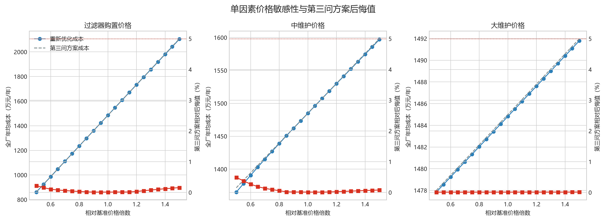
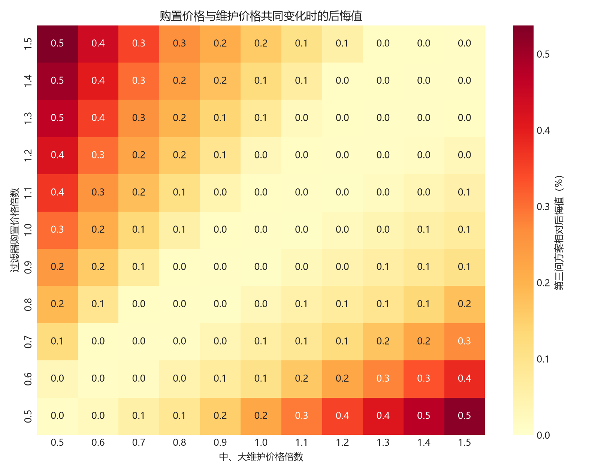
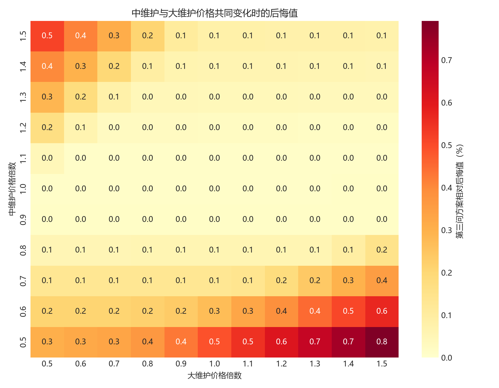

# 第四问：价格波动下维护方案的可行性

## 1. 分析口径

第四问保持第一至第三问的退化模型、寿命判据和候选策略不变，只改变以下价格：

- 过滤器购置价格：基准 300 万元；
- 中维护价格：基准 3 万元；
- 大维护价格：基准 12 万元。

对每个候选策略，先从蒙特卡洛轨迹计算年更换率 \(r_i\)、年中维护次数 \(m_i\) 和年大维护次数 \(l_i\)，价格为 \((c_0,c_M,c_L)\) 时的长期年均成本为

\[
J_i=c_0r_i+c_Mm_i+c_Ll_i.
\]

价格不进入第二问的状态转移方程，因此改变价格不会改变同一策略下的寿命和维护轨迹。第四问对每种新价格重新比较全部候选，而不是只给第三问方案换一组价格。

第三问方案的相对成本后悔值定义为

\[
R=
\frac{J_{\mathrm{第三问}}-J_{\mathrm{新最优}}}
{J_{\mathrm{新最优}}}.
\]

本文把 \(R\leq5\%\) 定义为原方案在该价格下仍然经济可行。

## 2. 计算设置

- 先用第三问 40 次蒙特卡洛筛选结果，在粗价格网格中为每台设备保留前 3 名候选；
- 共识别 54 个可能入选的设备—策略组合；
- 每个组合重新运行 200 次蒙特卡洛复核；
- 单因素价格倍数从 0.50 到 1.50，步长 0.05，共 63 个情景；
- 购置价—维护价双因素和中维护价—大维护价双因素均使用 11×11 网格；
- 最终共重新优化 305 个价格情景、3050 个设备级决策。

## 3. 基准价格复核

在基准价格下，200 次复核得到：

| 指标 | 数值 |
|---|---:|
| 重新优化全厂年均成本 | 1484.82 万元/年 |
| 第三问方案年均成本 | 1484.99 万元/年 |
| 绝对后悔值 | 0.17 万元/年 |
| 相对后悔值 | 0.012% |

差异来自蒙特卡洛复核样本变化。A6由S32调整为S33，A9由S33调整为S32，其余8台设备保持第三问规则；经济差异可以忽略。

## 4. 单因素敏感性

### 4.1 过滤器购置价格

| 价格倍数 | 购置价/万元 | 新最优成本 | 第三问方案成本 | 后悔值 | 年更换率 | 中维护/年 |
|---:|---:|---:|---:|---:|---:|---:|
| 0.50 | 150 | 860.84 | 862.75 | 0.22% | 4.18 | 73.29 |
| 0.75 | 225 | 1173.34 | 1173.87 | 0.05% | 4.16 | 74.52 |
| 1.00 | 300 | 1484.82 | 1484.99 | 0.01% | 4.15 | 75.58 |
| 1.25 | 375 | 1795.11 | 1796.11 | 0.06% | 4.12 | 79.04 |
| 1.50 | 450 | 2103.92 | 2107.23 | 0.16% | 4.12 | 79.04 |

购置价格上涨时，最优方案通过增加中维护、降低更换频率延长设备使用；购置价格下降时则允许更早更换。第三问方案在150—450万元范围内的最大后悔值仅0.22%。

### 4.2 中维护价格

| 价格倍数 | 中维护价/万元 | 新最优成本 | 第三问方案成本 | 后悔值 | 中维护/年 |
|---:|---:|---:|---:|---:|---:|
| 0.50 | 1.50 | 1365.05 | 1371.73 | 0.49% | 86.10 |
| 0.75 | 2.25 | 1427.02 | 1428.36 | 0.09% | 79.04 |
| 1.00 | 3.00 | 1484.82 | 1484.99 | 0.01% | 75.58 |
| 1.25 | 3.75 | 1541.10 | 1541.62 | 0.03% | 74.52 |
| 1.50 | 4.50 | 1597.00 | 1598.26 | 0.08% | 74.52 |

中维护降价后应提高维护频率；涨价后应适当减少中维护。第三问方案在1.5—4.5万元范围内最大后悔值为0.49%。

### 4.3 大维护价格

| 价格倍数 | 大维护价/万元 | 新最优成本 | 第三问方案成本 | 后悔值 | 大维护/年 |
|---:|---:|---:|---:|---:|---:|
| 0.50 | 6 | 1477.84 | 1478.00 | 0.01% | 1.16 |
| 1.00 | 12 | 1484.82 | 1484.99 | 0.01% | 1.16 |
| 1.50 | 18 | 1491.79 | 1491.99 | 0.01% | 1.16 |

大维护价格在6—18万元间变化时最优规则没有改变。这不是大维护价格不重要，而是第三问已经把缺乏恢复优势的大维护压缩到每年约1.16次，继续调整的空间很小。

## 5. 双因素敏感性

### 5.1 购置价格和维护价格共同变化

当购置价格和两类维护价格分别在基准值的50%—150%内变化时，第三问方案的最大相对后悔值为0.54%，出现在“购置价为150%、维护价为50%”附近。购置成本高而维护成本低时，重新优化会进一步增加维护以推迟更换；反方向则允许更早更换。

### 5.2 中维护和大维护价格共同变化

该价格面上的最大后悔值为0.79%，出现在中维护价格为1.5万元、大维护价格为18万元时。此时最优方案增加中维护、进一步减少大维护，全厂年均成本为1367.89万元；直接沿用第三问方案为1378.72万元，绝对后悔值10.83万元/年。

两个双因素价格面上的后悔值均远低于5%，说明第三问规则在测试范围内具有较强经济稳健性。

## 6. 最优规则如何随价格变化

所有305个价格情景中，10台设备的最优策略族始终为状态触发，变化主要发生在堵塞阈值和冷却期：

- 购置价格降至150万元：A1、A4的堵塞阈值由20提高到30，减少维护并接受较早更换；A9使用35日冷却期；
- 购置价格升至450万元：A5改用堵塞阈值10、35日冷却期，以更多维护延迟更换；
- 中维护降至1.5万元：A2、A10把冷却期由35日降至21日，A5、A9改用堵塞阈值10；
- 中维护升至4.5万元：A4把堵塞阈值提高到30，减少维护；
- 大维护价格单独变化时，设备级规则不变。

因此价格变化会改变精确最优参数，但不会改变“基于堵塞状态触发、以中维护为主、严格限制无明确增益大维护”的策略结构。

## 7. 可行性结论

采用5%近似最优标准，第三问维护方案在以下全部测试区间内仍然可行：

| 价格因素 | 可行价格区间 | 单因素最大后悔值 |
|---|---:|---:|
| 过滤器购置价 | 150—450万元 | 0.22% |
| 中维护价格 | 1.5—4.5万元 | 0.49% |
| 大维护价格 | 6—18万元 | 0.01% |

双因素情景最大后悔值为0.79%，同样小于5%。因此在题面基准价格上下50%的范围内，可以继续执行第三问方案，不必因小幅价格变化频繁切换规则；若价格接近区间边界，可按第6节调整设备级阈值和冷却期。

上述结论只覆盖已测试的50%—150%价格区间。超出该区间，或设备退化参数经新数据校准后发生明显改变时，应重新运行第四问优化程序。
