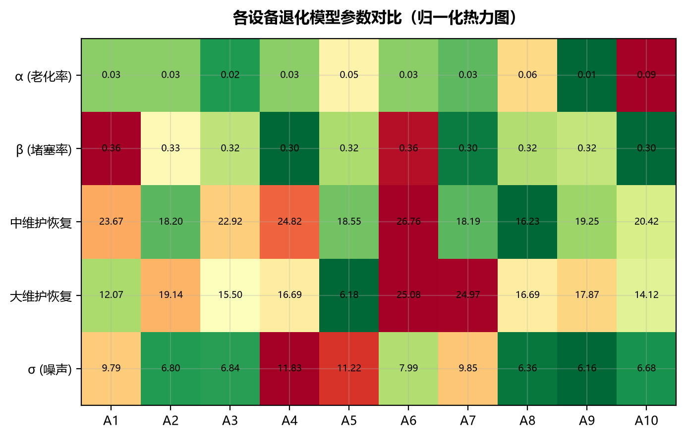
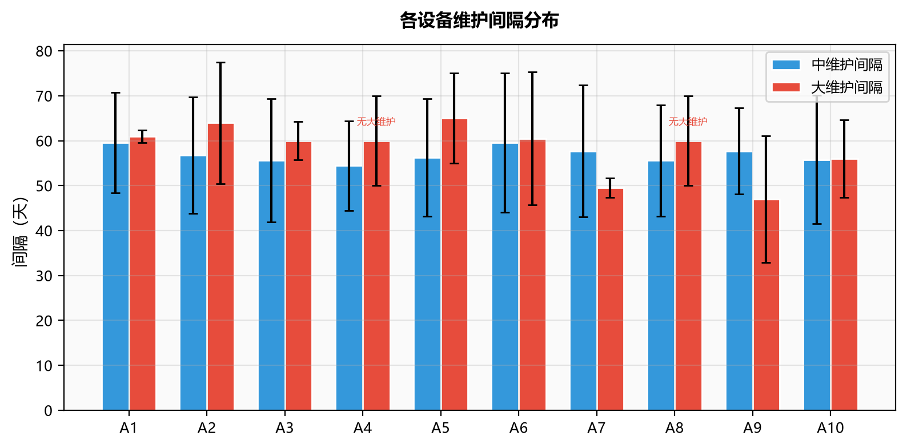
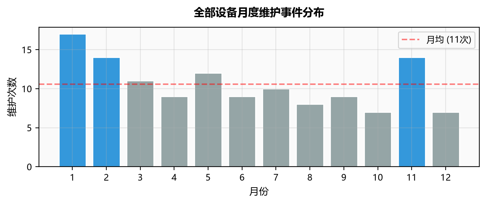
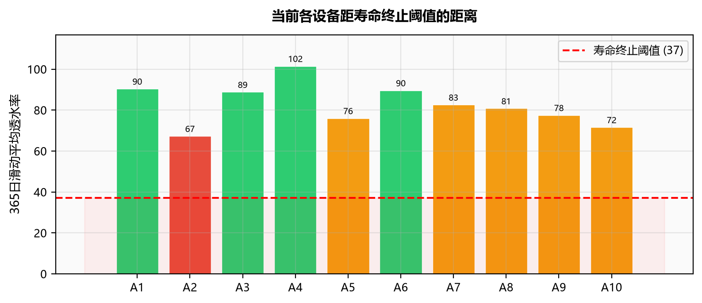

# 5 过滤器寿命预测模型

## 5.1 建模思路

第一问表明，透水率同时受到季节变化、维护周期内堵塞增长、维护清除和长期不可逆性能变化影响。维护前后等长窗口下降率变化的设备聚类区间跨 0，因此没有必要为维护后另设一套确定性堵塞增长率；维护效果持续时间又存在 90% 以上的右删失，说明维护清除的状态改善通常至少保持到下一次维护。

据此，将第 \(i\) 台过滤器的透水率分解为不可逆性能上限 \(C_i(t)\)、可逆堵塞 \(F_i(t)\)、季节项 \(S(t)\) 和随机扰动：

\[
P_i(t)=C_i(t)-F_i(t)+S(t)+\varepsilon_i(t).
\tag{16}
\]

模型按日推进，按照附件 2 提取的当前固定维护规律生成未来维护事件，并采用题面“年平均低于 37 且维护后无法有效改善”的双条件终止准则预测寿命。

## 5.2 双状态退化模型

### 5.2.1 季节项

第二问直接复用第一问拟合得到的四个谐波系数，而不是根据峰值日重新构造相位：

\[
\begin{aligned}
S(t)=\;&a_1\sin\frac{2\pi q_t}{365.25}
+b_1\cos\frac{2\pi q_t}{365.25}\\
&+a_2\sin\frac{4\pi q_t}{365.25}
+b_2\cos\frac{4\pi q_t}{365.25},
\end{aligned}
\tag{17}
\]

其中

\[
(a_1,b_1,a_2,b_2)
=(-9.633,-11.646,2.111,-1.893).
\]

该写法与第一问的年、半年联合季节曲线完全一致。

### 5.2.2 日状态推进

\[
\begin{aligned}
C_i(t+1)&=C_i(t)-\alpha_i+\eta_{C,i}(t),\\
F_i(t+1)&=\max\{F_i(t)+\beta_i+\eta_{F,i}(t),0\},\\
\varepsilon_i(t)&\sim\mathcal N(0,\sigma_i^2).
\end{aligned}
\tag{18}
\]

程序中 \(\eta_C\) 和 \(\eta_F\) 的标准差分别设为 \(0.5\max(\alpha_i,0.001)\) 和 \(0.3\beta_i\)。小维护没有日期记录，且成本可忽略，因此其平均作用已包含在历史周期净下降率 \(\beta_i\) 中；第三问和第四问保持相同的小维护背景口径。

### 5.2.3 维护状态更新

第一问的 \(MG\) 是维护后 1—3 日相对无维护反事实轨迹的恢复量，因而在维护发生时直接用于清除可逆堵塞：

\[
\begin{aligned}
F_i(t^+)&=\max\{F_i(t^-)-MG_i^{(m)},0\},\\
C_i(t^+)&=C_i(t^-)-\delta_i^{(m)},
\end{aligned}
\tag{19}
\]

其中 \(m\in\{\text{中维护},\text{大维护}\}\)。第一问的 \(MP30\) 不再乘到瞬时恢复量上，因为它描述第 30 日保持程度，并不是瞬时清除系数。

题面指出维护也会破坏过滤器性能，但仅凭两年观测无法把自然老化与逐次维护损伤完全识别。为使模型能用于第三问改变维护频率，基准情景将历史上包络年衰减 \(ED_i\) 的 20% 分配给维护损伤，并假设一次大维护的损伤为一次中维护的 3 倍：

\[
\begin{aligned}
365.25\alpha_i
+n_{i,\mathrm{med}}\delta_{i,\mathrm{med}}
+n_{i,\mathrm{maj}}\delta_{i,\mathrm{maj}}
&=ED_i,\\
\delta_{i,\mathrm{maj}}&=3\delta_{i,\mathrm{med}}.
\end{aligned}
\tag{20}
\]

20% 是透明的结构情景，而非可由当前数据唯一识别的事实。第三问应对 0%、20% 和 40% 损伤占比做稳健性比较；第四问的价格敏感性应在这些模型情景下复核。

## 5.3 参数估计

自然老化率由正则化后的 \(ED_i\) 扣除基准维护损伤份额后得到；堵塞增长率按

\[
\beta_i=\max\{DR_i-\alpha_i,0.01\}
\tag{21}
\]

计算。维护恢复量取设备级事件中位数；A4、A8 没有大维护记录，其大维护恢复量采用其余设备总体中位数。过程噪声取第一问完整模型的设备级残差标准差。

**表 5  双状态模型主要参数**

| 设备 | \(\alpha_i\)/日 | \(\beta_i\)/日 | 中维护恢复 | 大维护恢复 | 中维护损伤 | 大维护损伤 | \(\sigma_i\) |
|:---:|---:|---:|---:|---:|---:|---:|---:|
| A1 | 0.0315 | 0.3580 | 23.7 | 12.1 | 0.36 | 1.09 | 9.8 |
| A2 | 0.0315 | 0.3301 | 18.2 | 19.1 | 0.32 | 0.97 | 6.8 |
| A3 | 0.0191 | 0.3202 | 22.9 | 15.5 | 0.21 | 0.62 | 6.8 |
| A4 | 0.0315 | 0.3000 | 24.8 | 16.7* | 0.45 | 1.34 | 11.8 |
| A5 | 0.0547 | 0.3182 | 18.6 | 6.2 | 0.67 | 2.01 | 11.2 |
| A6 | 0.0315 | 0.3560 | 26.8 | 25.1 | 0.36 | 1.09 | 8.0 |
| A7 | 0.0257 | 0.3025 | 18.2 | 25.0 | 0.28 | 0.83 | 9.8 |
| A8 | 0.0606 | 0.3188 | 16.2 | 16.7* | 0.86 | 2.58 | 6.4 |
| A9 | 0.0102 | 0.3207 | 19.2 | 17.9 | 0.11 | 0.33 | 6.2 |
| A10 | 0.0929 | 0.3003 | 20.4 | 14.1 | 0.90 | 2.70 | 6.7 |

\(*\) 跨设备共享估计。

## 5.4 当前固定维护规律

附件 2 共含 127 次维护，其中中维护 110 次、大维护 17 次。程序按“上一记录维护到下一记录维护”的事件间隔分别估计下一事件为中维护或大维护时的间隔，避免把约 50—65 日的事件间隔误称为两次大维护之间的间隔。未来排程从 2026-04-10 的真实状态继续：首个间隔扣除距最近一次维护已经过去的天数，并继承距最近大维护后的中维护计数。

设备级中维护事件间隔约为 54—60 日。存在大维护记录的设备通常在 2—8 次中维护后插入一次大维护；A4、A8 没有大维护记录，采用总体典型的“4 次中维护后进行大维护”和总体大维护事件间隔。该插补必须在第三问中作为不确定情景单独检查。

## 5.5 寿命终止准则

条件一为 365 个连续日历日的平均透水率低于 37：

\[
\overline P_{i,365}(t)
=\frac1{365}\sum_{k=0}^{364}P_i(t-k)<37.
\tag{22}
\]

满足条件一时，在当前状态上实施一次假设大维护，并按式（18）继续无噪声推进 30 日。若

\[
\widehat{\overline P}_{i,30}^{\,\mathrm{大维护后}}(t)<37,
\tag{23}
\]

则认为即使大维护也不能有效恢复，寿命终止。这里计算的确实是维护后 30 日平均，而不是维护瞬间的单日值。

历史截至 2026-04-10 的 365 日平均透水率均高于 37，因此 10 台设备当前均未终止。

## 5.6 蒙特卡洛预测

仿真从 2026-04-10 开始，每台设备运行 1000 次。每次运行对自然老化率和维护损伤施加相关乘性扰动，对堵塞率及维护恢复量分别施加乘性扰动。最长随访 25 年；未达到寿命终点的运行按右删失处理，并使用 Kaplan–Meier 寿命分位数。此次全量结果的 10 000 条轨迹均在 25 年内观察到寿命终点，右删失率为 0。

**表 6  当前固定维护规律下的剩余寿命预测**

| 设备 | 中位寿命/年 | 95%预测区间/年 | 中位终止日期 | 中维护次数 | 大维护次数 |
|:---:|---:|:---:|:---:|---:|---:|
| A1 | 3.49 | 1.30—6.50 | 2029-10-04 | 17 | 4 |
| A2 | 1.30 | 0.63—2.46 | 2027-07-27 | 7 | 1 |
| A3 | 4.91 | 1.44—7.66 | 2031-03-09 | 25 | 7 |
| A4 | 5.31 | 2.71—7.64 | 2031-08-01 | 27 | 7 |
| A5 | 1.00 | 0.74—1.62 | 2027-04-12 | 4 | 2 |
| A6 | 3.49 | 1.51—5.04 | 2029-10-07 | 14 | 7 |
| A7 | 2.61 | 1.04—4.00 | 2028-11-17 | 14 | 3 |
| A8 | 1.14 | 0.76—1.78 | 2027-06-02 | 6 | 1 |
| A9 | 7.06 | 1.24—12.55 | 2033-05-02 | 40.5 | 6 |
| A10 | 0.74 | 0.59—0.95 | 2027-01-04 | 4 | 1 |

A9 的中位剩余寿命最长，但区间也最宽；A10、A5、A8 和 A2 属于近期高风险设备。寿命排序主要受不可逆上包络衰减、当前状态和维护恢复量共同影响，不能仅按当前单日透水率排序。

## 5.7 无时间泄漏回测

以 2025-04-10 为切分点，只使用此前数据重新估计全部季节、退化和维护参数，再使用验证期的真实维护日期预测 2025-04-10 至 2026-04-10。该过程避免了原方案用验证期数据估计参数的时间泄漏。

**表 7  一年期训练外回测**

| 设备 | MAE | 偏差 | 90%区间覆盖率 |
|:---:|---:|---:|---:|
| A1 | 12.90 | -4.74 | 0.326 |
| A2 | 5.22 | 2.56 | 0.870 |
| A3 | 8.89 | 7.68 | 0.587 |
| A4 | 8.46 | 0.36 | 0.843 |
| A5 | 27.42 | -27.41 | 0.025 |
| A6 | 27.52 | 27.52 | 0.057 |
| A7 | 7.38 | -0.90 | 0.905 |
| A8 | 5.93 | -1.57 | 0.815 |
| A9 | 11.24 | 8.41 | 0.513 |
| A10 | 4.14 | 2.20 | 0.961 |

回测显示 A2、A4、A7、A8、A10 的一年期轨迹具有一定预测能力，但 A5、A6 存在明显结构变化，A1、A3、A9 也存在较大误差。因此表 6 应解释为“在当前双状态结构、固定维护规律和参数扰动假设下的条件预测”，而不是高精度确定性寿命。第三问不能只优化表 6 的点估计，必须同时检查不同参数样本、维护损伤占比和 A4/A8 大维护插补情景。

## 5.8 第三问和第四问接口

动态函数 `simulate_one_device()` 已实际支持：

- 中维护事件间隔、波动和大维护插入规则；
- 当前周期已运行天数及距最近大维护的中维护次数；
- 中、大维护恢复量和逐次性能损伤；
- 寿命阈值、维护后恢复窗口和最长随访；
- 设备购置成本、中维护成本和大维护成本。

单次运行输出寿命或右删失状态、中/大维护次数、全周期平均透水率、最终 365 日均值、维护后 30 日恢复值、总成本和年均成本。`monte_carlo_simulate()` 可在任意候选维护方案下返回寿命与成本分布，因而可直接作为第三问目标函数，并由第四问循环改变价格参数。

进入第三问时应采用以下约束：

1. 对每个候选策略使用共同随机数，降低方案比较噪声；
2. 对 A4/A8 大维护规律、维护损伤占比和关键退化参数做情景鲁棒优化；
3. 若存在右删失，不得把最长随访当作真实寿命；
4. 年均成本比较必须同时报告透水率约束违约概率；
5. A5/A6 的结果应给予更高不确定性权重，并单独做保守方案。

## 5.9 本问结论

1. 建立了由不可逆性能状态和可逆堵塞状态组成的日尺度寿命模型，并精确复用第一问四个季节谐波系数。
2. 正确实现“365日平均低于37且大维护后30日平均仍低于37”的双条件终止规则。
3. 当前固定维护下，A9 的剩余寿命中位数最长，为 7.06 年；A10 最短，为 0.74 年。
4. 1000次蒙特卡洛结果显式处理右删失，本次全量仿真未出现25年右删失。
5. 训练期限定回测揭示 A5/A6 等设备存在显著结构不确定性，因此后续维护优化必须采用情景和风险约束，不能仅优化点估计。
6. 仿真器已经输出寿命、维护次数、透水率和年均成本，可进入第三问维护策略优化及第四问成本敏感性分析。
